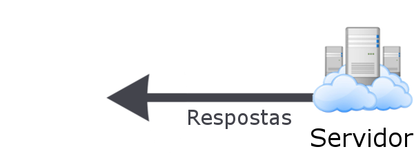

# Backend NodeJS com Express e consumo com Frontend JS (Vanilla) - Parte 1

Que legal que você escolheu o módulo FullStack para seguir sua jornada na Blue, estamos muito felizes que esteja por aqui 😃!

Durante este módulo, aprenderemos como trabalhar de forma separada as duas partes fundamentais das aplicações web: **backend** e **frontend**.

No módulo 3, trabalharemos com as seguintes tecnologias:

- **Backend:** NodeJS, JavaScript e Express, utilizando o banco de dados MongoDB
- **Frontend:** NodeJS, JavaScript e ReactJS, além de HTML e CSS

## O que é o full-stack?

Como mencionamos anteriormente, dev full-stack é a pessoa que possui domínio das duas principais áreas do desenvolvimento web: **frontend** e **backend**. Para entender de forma clara o papel de cada um, é preciso conhecer a arquitetura **cliente-servidor**.

### Cliente (Frontend)

A parte do **cliente** é capaz de utilizar as linguagens de marcação HTML e CSS para exibir páginas, além de também envolver uma linguagem de programação, o JavaScript, que é executada direto pelo navegador, trazendo comportamentos para a página sem que ela precise ser recarregada.

Entretanto, além de todo o código HTML, CSS e JavaScript estar exposto no navegador, todas as informações também ficam armazenadas no computador da pessoa. Sendo assim, não conseguimos garantir que aquelas informações permaneceram disponíveis em outros dispositivos que a pessoa acessar.

Sempre que o **cliente** quiser alguma informação que estiver armazenada na base de dados, ele deve solicitá-la através de uma requisição ao **servidor (backend)**.


## Servidor (Backend)

É exatamente nesse momento que **servidor** entra! Quando possuímos alguma informação que valha a pena guardar, recebemos uma solicitação do **cliente** para armazená-la e certificamos de que ela esteja segura em um banco de dados.

Um **servidor** geralmente roda em uma protocolo de transporte de dados, como o protocolo HTTP (Hyper Text Transfer Protocol), que se comunica através das placas de rede dos computadores, recebendo **requisições** e enviando **respostas** para quem tiver acesso à URL da aplicação backend.



Para isso, o **servidor** precisa de uma linguagem de programação que consiga disponibilizar conexão com o protocolo HTTP. Atualmente, algumas das linguagens mais comuns em aplicações backend são: JavaScript, TypeScript, Java, PHP, C#, Python, C++, entre diversas outras.

Além disso, é na camada do servidor em que a conexão com o banco de dados é feita, pois é nessa camada que conseguimos proteger os dados de acesso como `endereço`, `usuário` e `senha`, uma vez que a camada do cliente (frontend) está exposta e vulnerável.

## Fluxo cliente-servidor

Na prática, separamos a nossa aplicação em duas camada: uma de **apresentação** e outra de **processamento de dados**.

A camada de **apresentação** faz com que a informação chegue de forma apresentável e com a melhor experiência de usuário possível.

Já a camada de **processamento de dados** garante que as informações estão disponíveis, seguras e validam que cada etapa ocorra da maneira certa.

Apesar de diferentes, os dois lados precisam trabalhar juntos para garantir a usabilidade do site e uma boa experiência de navegação.


## Construindo a aplicação

Com isso em mente, ao longo dessa semana, construiremos um **servidor backend**, também conhecido como API, utilizando o motor NodeJS e a linguagem de programação JavaScript.

Apesar de ser possível fazer com que nossa aplicação em NodeJS se comunique com outras aplicações através do protocolo HTTP, essa tarefa não é tão fácil sem uma ajudinha extra. É exatamente nessa etapa que utilizaremos bibliotecas e frameworks, para que possamos focar exatamente no que importa da nossa aplicação.

Como usamos no módulo 2, o framework `Express` é fundamental para facilitar a construção de páginas da web que exibem conteúdos em HTML. Entretanto, para separar o **cliente** do **servidor**, precisamos utilizar o express apenas como acesso aos dados.

Para isso, utilizaremos um formato de troca de dados conhecido como `JSON`. Nosso **cliente** (frontend) irá fazer uma solicitação ao **servidor** (backend) para acessar esses dados. O servidor, então, irá buscar os dados direto da fonte (seja um arquivo, um banco de dados ou qualquer local equivalente) e entregá-los de uma forma que o cliente (frontend) entenda.

Portanto, iremos começar o desenvolvimento da nossa aplicação pelo backend, para que os dados estejam disponíveis quando o frontend quiser exibí-los.

## Sobre o que será a nossa primeira aplicação?

Ao longo dessa semana, criaremos uma aplicação que gerenciará oportunidades de emprego, chamada Blue-Vagas.

Nela será possível visualizar:

- empresa que está contratando;
- função que estão buscando;
- tipo de contrato;
- salário.

Com ela também poderemos adicionar novas oportunidades, alterar e excluir.


Essa aplicação consistirá em um CRUD completo no backend em nodeJs, utilizando o framework `express`, além de introduzir novos aspectos como as camadas de `routes` e `service` que, em conjunto com o `controller`, deixaram a nossa aplicação mais organizada e de fácil manutenção.

## Construindo o backend

Utilizando as mesmas instruções do módulo 2, precisamos criar o projeto do backend, instalar o `express` e realizar as configurações iniciais.

Primeiro, crie uma pasta vazia e abra-a com o VSCode.

Com a pasta aberta, abra uma nova aba do terminal e inicialize o projeto NodeJS, através do comando:

```bash
npm init -y
```

 Com isso, o arquivo `package.json` será criado.

Agora, instale o `express`, através do comando:

```bash
npm i express
```

Enquanto a instalação está em progresso, crie um arquivo chamado `index.js`.

Nesse arquivo, configuraremos a versão inicial da nossa aplicação, que possuirá o conteúdo:

- A declaração `require` para importar o `express`;
- A execução do `express`, que será a nossa aplicação armazenada na variável `app`;
- A variável `port` para declararmos em qual porta nossa aplicação se conectará;
- Uma declaração de endpoint (`app.get`) para preparar a aplicação para receber uma **requisição** e enviar uma **resposta**;
- Ao finalizar, utilizaremos a declaração `app.listen` para conectar a aplicação à porta que foi declarada na variável `port`.

> **Nota:** detalharemos um pouco mais a frente a declaração de endpoints.

```javascript
const express = require("express");
const app = express();

const port = 3000;

app.get("/", function (req, res) {
    res.send({ message: "Hello, JSON!" });
});

app.listen(port, () => {
    console.log(`App running at http://localhost:${port}`);
});
```

Para rodar a aplicação, digite o comando no terminal:

```bash
node index
```

### Testando a aplicação

## Thunder Client

Sempre que vamos fazer alguma requisição para testar a API em desenvolvimento, temos algumas ferramentas disponíveis como o POSTMAN, Insomnia dentre outros. Nesse caso, a ferramenta com maior facilidade e integração com o VSCode é o [Thunder Client](https://marketplace.visualstudio.com/items?itemName=rangav.vscode-thunder-client), que é um plugin super leve e intuitivo.

No Thunder conseguimos criar requisições e até conjunto de requisições (collections) para que possamos fazer repetidos testes onde podemos garantir que temos uma API REST / RESTful.

## Instalação e configuração

Se você ainda não tem ele instalado, vá até a área de extensões do VSCode, pesquise por "Thunder Client" e faça a instalação clicando no botão install:


Após ser instalado, vai aparecer um ícone do plugin na barra lateral esquerda, clique sobre ele:


Dentro do Thunder temos 3 abas, a aba Activity onde observamos as requisições mais recentes, a aba Collections onde podemos fazer grupos de requisições e a aba Env, onde criamos variáveis de ambiente, para que possamos mudar o endereço das requisições de forma mais fácil.

## Env

Clicando na aba Env, vamos configurar a nossa uri (URL + Porta) padrão das requisições, após clicar na aba, clique no menu (3 linhas) indicado na imagem:


Clique no botão "New Environment":


De um no nome para a sua Environment, essa vou nomear como "localhost" e aperte Enter:


O nosso ambiente recém criado, vai aparecer no canto esquerdo, clique sobre ele, defina um nome da variável como "uri", defina o valor como "localhost:3000" e clique em salvar:


Nossa variável de ambiente do Thunder está pronta! No Próximo passo, vamos aprender a utiliza-lá.

## New request

Clicando no botão "New Request" vamos configurar a nossa primeira requisição:


Altere o endereço da requisição para:

```http
{{uri}}/filmes
```

E clique em "Send"


Feito isso, essa requisição ficará registrada em Activity, clique nos 3 pontinhos da requisição:


Aperte em "Save to Collection":


Dê um nome para a requisição e crie uma Collection nova clicando em "Create New":


Escreva o nome da Collection e clique em "Submit":


Pronto! Agora temos uma Collection com a nossa primeira requisição registrada. Registre todas principais requisições, GET, POST, PUT, DELETE e assim facilitará os testes no dia a dia.

### JSON


JSON, que significa JavaScript Object Notation, é uma formatação utilizada para estruturar dados em formato de texto e transmiti-los de um sistema para outro, como em aplicações cliente-servidor ou em aplicativos móveis. Uma maneira de utilização é por meio de requisições AJAX, em que a aplicação recupera os dados armazenados no servidor de hospedagem sem a necessidade de recarregar a página.

A especificação JSON surgiu por volta do ano 2000, mas só passou a fazer parte da linguagem JavaScript após o lançamento da versão 5 do ECMAScript. Atualmente, esse formato é suportado por diversos tipos de linguagem de programação, além de ser uma alternativa mais leve que o modelo XML.

- Leitura mais simples
- Analisador (parsing) mais fácil
- JSON suporta objetos! Sim, ele é tipado!
- Velocidade maior na execução e transporte de dados
- Arquivo com tamanho reduzido

### Adicionando dados customizados

<!-- Revisão parou aqui -->

Após essas configurações podemos criar o nosso conjunto de dados que serão consumidos pelo nosso aplicativo, nesse caso será utilizado uma lista de objetos contendo informações sobre as vagas de emprego

```javascript
const blueVagas = [
  {
    id: 1,
    empresa: "Blue",
    salario: 3000,
    oportunidade: "Front-end Jr",
    tipo: "estágio",
  },
  {
    id: 2,
    empresa: "Google",
    salario: 6000,
    oportunidade: "Front-end Jr",
    tipo: "estágio",
  },
  {
    id: 3,
    empresa: "Tech Brasil",
    salario: 2300,
    oportunidade: "Back-end Jr",
    tipo: "CLT",
  },
  {
    id: 4,
    empresa: "Jouzer",
    salario: 5000,
    oportunidade: "Back-end Pleno",
    tipo: "PJ",
  },

];
```

Definido os dados, é possível começar a preparação das rotas que serão utilizadas na nossa aplicação, nesse primeiro momento serão construídas as rotas que levarão as informações das vagas ao frontend. Assim será utilizado o método HTTP `GET` com o `app.get`, com ele podemos definir a rota que será utilizada e criar uma função de callback onde se utilizará response.send para enviar as informações de todos as vagas para o frontend

```javascript
app.get("/vagas", (req, res) => {
    res.send(blueVagas);
});
```

Com essa primeira rota construída, será feito também uma rota para a seleção de uma vaga pelo seu `Id`.
Assim, novamente será utilizado o `app.get` onde o `id`  escolhido virá pela `url` e assim ele pode ser tratado e adicionado a uma variável id, com esse valor guardado pode-se realizar o método `find()` na nossa lista de vagas para encontrar o vaga escolhida e enviar.

```javascript
app.get("/vaga/:id", (req, res) => {
  const urlId = req.params.id;
  const vagaEscolhida = blueVagas.find((vaga) => vaga?.id == urlId);
  res.send(vagaEscolhida);
});
```

### CORS

 Um detalhe importante para lembrar é o CORS, ele que vai garantir a permissão de acesso para o compartilhamento de recursos com origens diferentes (Cross-Origin Resource Sharing). 

 Toda vez que o frontend tenta se comunicar com o back-end, é feita uma requisição e o nosso back-end (API) devolve uma resposta, e o CORS serve para proteger as requisições para que sites com alguma requisição (`GET`, `PUT`,` PATCH` e outras) potencialmente perigosa, só seja liberado caso o acesso tenha sido liberado na API. Para desabilitar o CORS, basta adicionar alguns `headers` por meio de um `middleware` na nossa requisição:

```javascript
app.all('/*', (req, res, next) => {
    res.header('Access-Control-Allow-Origin', '*');
    res.header('Access-Control-Allow-Methods', '*');
    res.header(
        'Access-Control-Allow-Headers',
        'Access-Control-Allow-Headers, Origin, Accept, X-Requested-With, Content-Type, Access-Control-Request-Method, Access-Control-Request-Headers, Authorization',
    );
    next();
});
```

## Frontend

Com a API preparada para receber requisições `GET`, pode-se criar uma aplicação simples para o consumo dessas rotas.

Para isso, vamos criar um arquivo HTML com seu template inicial gerado pelo VsCode e mudar algumas informações, como o `lang` que é responsavel por definir a lingua da nossa pagina e o `title` que define o nome da nossa página e é exibido na aba do navegador.

```html
<!DOCTYPE html>
<html lang="pt-br">
    <head>
        <meta charset="UTF-8">
        <meta http-equiv="X-UA-Compatible" content="IE=edge">
        <meta name="viewport" content="width=device-width, initial-scale=1.0">
        <title>Blue-Vagas</title>
    </head>
    <body>

    </body>
</html>
```

Com essas configurações definidas podemos criar e importar o nosso arquivo css e o javascript, assim ficando da seguinte maneira:

```html
<!DOCTYPE html>
<html lang="pt-br">
    <head>
        <meta charset="UTF-8">
        <meta http-equiv="X-UA-Compatible" content="IE=edge">
        <meta name="viewport" content="width=device-width, initial-scale=1.0">
        <title>Blue-Vagas</title>
        <link rel="stylesheet" href="style.css">
    </head>
    <body>

        <script src="./script.js"></script>
    </body>
</html>
```

Assim podemos começar a criar a estrutura de tabelas que serão utilizados para exibir as vagas e adicionar um estilo básico para identificação

```html
<main>
    <table id="allVagas">
        <tr>
            <th>Id</th>
            <th>Empresa</th>
            <th>Oportunidade</th>
            <th>Tipo</th>
            <th>Salario</th>
        </tr>
        <tr>
            <td>${id}</td>
            <td>${empresa}</td>
            <td>${oportunidade}</td>
            <td>${tipo}</td>
            <td>${salario}</td>
        </tr>
    </table>
</main>
```

Definida a estrutura, podemos contruir essa lista de maneira dinâmica para deixar o código mais limpo e ser mais flexivel de acordo com o retorno da API. Contudo, antes de montar as linhas é necessário consumir a API criada, assim vamos criar uma constante `baseUrl` para facilitar em possíveis mudanças e criar uma async função responsável pela requisição HTTP `GET`, assim que receber a resposta do servidor, será extraído os dados do corpo da resposta com o `.json()` e guardado em uma constante vagas.

```javascript
const baseUrl = "http://localhost:3000";

const getVagas = async () => {
  const response = await fetch(baseUrl + "/vagas");

  const vagas = await response.json();
};
getVagas();
```

Agora que temos a nossa lista de objetos, podemos utilizar o metodo `forEach` para passar por cada objeto da lista. Assim ele entrará em um objeto por vez, que chamaremos de vaga, e com ele em mãos, podemos adicionar a linha da vaga na `div` com o `id ="allVagas"`.

```javascript
const baseUrl = "http://localhost:3000";

const getVagas = async () => {
  const response = await fetch(baseUrl + "/vagas");

  const vagas = await response.json();

  vagas.forEach((vaga) => {
    document.getElementById("allVagas").insertAdjacentHTML(
      "beforeend",
      `<tr>
        <td>${vaga.id}</td>
        <td>${vaga.empresa}</td>
        <td>${vaga.oportunidade}</td>
        <td>${vaga.tipo}</td>
        <td>${vaga.salario}</td>
      </tr>`
    );
  });
};
getVagas();
```

Para realizar o consumo da rota de vaga por `id`, criaremos uma forma para o usuário escolher a vaga em que quer se candidatar.

```html
        <div>
            <div>
                <input type="number" id="idVaga">
                <button onclick="vagaEscolhida()">escolher</button>
            </div>
            <div>
                <h2>Minha vaga escolhida:</h2>
                <table id="vaga">

                </table>
            </div>
        </div>
```

Nessa estrutura HTML é importante trazer:

- `Input` para o usuário;
- Botão para enviar o evento;
- Um espaço reservado para adicionar o linha da vaga escolhida.

Assim, podemos ir para o JS e criar a função que será chamada pelo botão

```javascript
const vagaEscolhida = async () => {
  let id = document.getElementById("idVaga").value;

  const response = await fetch(`${baseUrl}/vaga/${id}`);

  const vagaCandidatada = await response.json();

  document.getElementById("vaga").insertAdjacentHTML(
    "beforeend",
    `<tr>
      <td>${vagaCandidatada.id}</td>
      <td>${vagaCandidatada.empresa}</td>
      <td>${vagaCandidatada.oportunidade}</td>
      <td>${vagaCandidatada.tipo}</td>
      <td>${vagaCandidatada.salario}</td>
    </tr>`
  );
};
```

A estrutura dessa parte é bem similar a que exibia todos as vagas, nela iremos consumir a API enviando o `id` na `url` e com o retorno das informações da vaga vamos criar a linha dinamicamente e adicionar na tabela.

